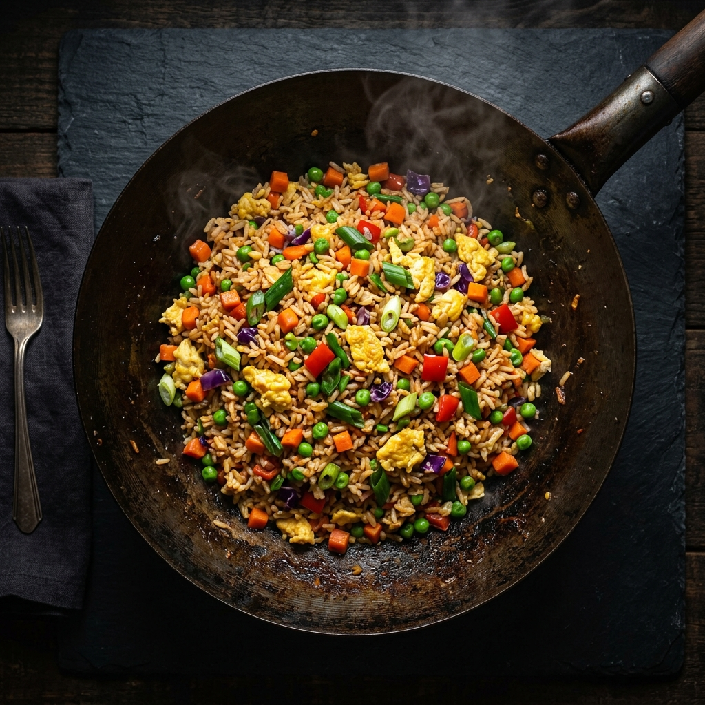

# 🥘 RoomieMeal

> **"One kitchen. Everyone feels safe."**

RoomieMeal is a premium, modern, and completely **offline-first** web application designed to solve the universal roommate dilemma: *"What can we eat tonight that won't make anyone sick?"*

By remembering everyone's dietary boundaries—from severe allergies to simple dislikes—RoomieMeal acts as a smart kitchen dashboard to ensure every shared meal is compatible with the entire household.

 *(Replace with actual screenshot)*

---

## ✨ Core Features

*   **🛡️ Conflict Rules Engine:** Evaluates every recipe against the active household profile. Instantly flags meals with "Allergy conflict" (Red), "Modification suggested" (Yellow), or "No listed conflicts detected" (Green).
*   **🍽️ "What Can We Eat Tonight?":** A powerful discovery tool that instantly ranks and recommends the safest, most compatible meals for the household based on current pantry inventory and dietary restrictions.
*   **👥 Roommate Profiles:** Track individual allergies, intolerances, dietary preferences (Vegan, Keto, etc.), and even disliked ingredients.
*   **📅 Weekly Planner:** Drag-and-drop planning to seamlessly organize breakfasts, lunches, and dinners.
*   **🛒 Smart Grocery List:** Automatically aggregates missing ingredients from your weekly plan into a unified checklist.
*   **🧑‍🍳 Hands-Free Cooking Mode:** Step-by-step, distraction-free cooking interface designed to be viewed from across the kitchen island.
*   **🗳️ Household Voting:** Can't decide? Open a quick poll and let the household vote on tonight's dinner.
*   **📶 100% Offline-First:** No accounts, no APIs, no cloud sync delays. All your household data is securely managed client-side in your browser's local storage.

---

## 🛠️ Tech Stack

RoomieMeal is built with a modern, lightning-fast frontend stack:

*   **Framework:** [Next.js 14](https://nextjs.org/) (App Router ready, utilized as an SPA)
*   **UI Library:** [React 18](https://react.dev/)
*   **Styling:** [Tailwind CSS](https://tailwindcss.com/) (Custom `app-*` premium dark theme)
*   **Icons:** [Lucide React](https://lucide.dev/)
*   **State Management:** React Context API + LocalStorage Synchronization
*   **Language:** TypeScript

---

## 🚀 Getting Started

Because RoomieMeal is entirely API-free and client-side, running it locally is incredibly simple.

### Prerequisites
*   Node.js (v18 or higher)
*   npm (v9 or higher)

### Installation

1.  Clone the repository:
    ```bash
    git clone https://github.com/omshree59/Hackto-ROMMIEMEAL-.git
    cd roomiemeal
    ```

2.  Install the dependencies:
    ```bash
    npm install
    ```

3.  Start the development server:
    ```bash
    npm run dev
    ```

4.  Open [http://localhost:3000](http://localhost:3000) in your browser. The app will automatically populate with a mock household (Alex, Maya, Sam, Omshree) so you can test the features immediately!

---

## 🎨 Design Philosophy

RoomieMeal was intentionally designed to look like a **premium food application**, avoiding the sterile look of standard admin dashboards. 

It features a custom deeply-layered dark mode (`#0B0D0F` base, `#14171A` surfaces) punctuated by vibrant semantic highlights (Orange for primary actions, Green for safety, Red for conflicts) to make navigation intuitive in a busy kitchen environment.

---

## ⚠️ Important Disclaimer

**RoomieMeal is a meal-planning utility, NOT a medical diagnostic tool.**

While the app helps flag potential ingredient conflicts based on user input, it cannot guarantee a recipe is medically safe. Cross-contamination, hidden ingredients in packaged goods, and severe anaphylactic allergies require human diligence. 

Always encourage users with serious allergies to verify physical ingredient labels and cross-contamination risks themselves.

---

*Built with ❤️ for roommates everywhere.*
